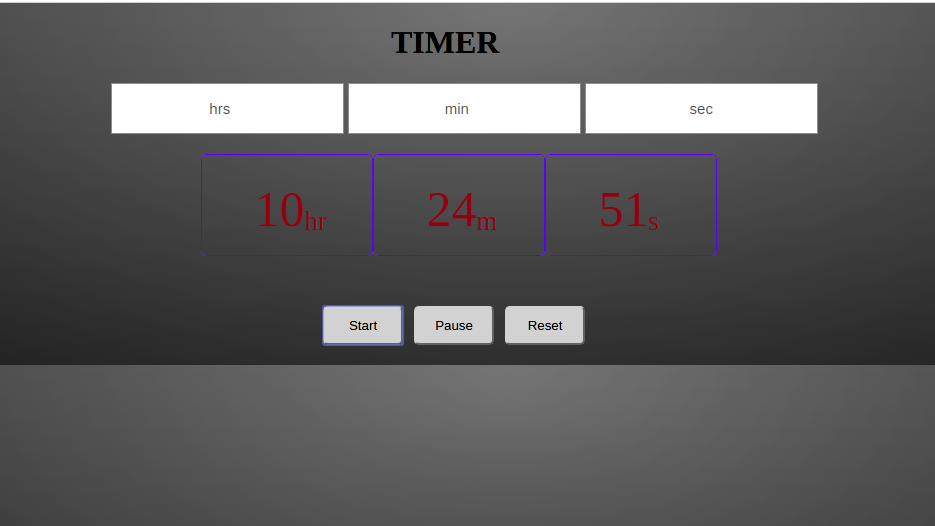

# Project_Timer

This project was created  with vanilla Js and CSS.

## Overview of The Project:
Project Timer is a useful tool to keep the track of the time while working on the projects..

<a href =  "https://pandayzyx.github.io/Project_timer/">
  <button style = "background:red,padding:5px">Demo Link</button>
</a>

  

